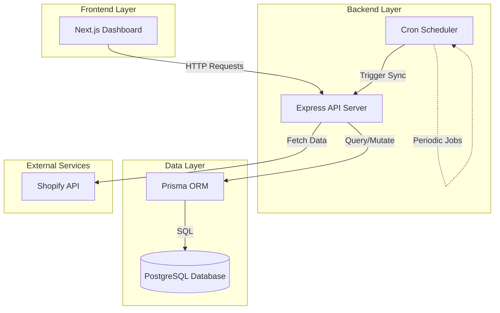
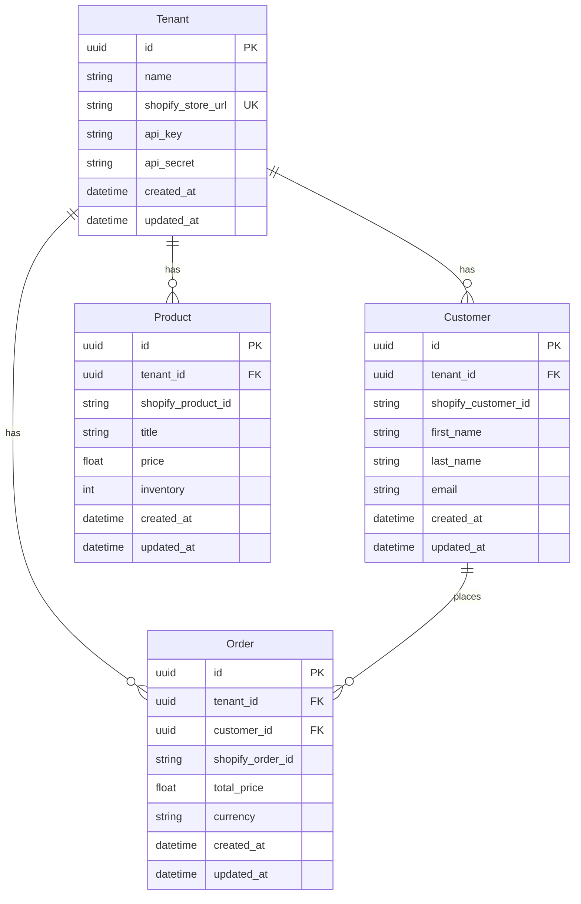

# Architecture Documentation

## System Overview

The Multi-Tenant Shopify Data Ingestion & Insights Service is a full-stack application that enables multiple Shopify stores to sync their data and view analytics through a unified platform.

## Architecture Diagram



## Component Architecture

### Frontend (Next.js)

**Technology Stack:**
- Next.js 16 (React 19)
- TypeScript
- Tailwind CSS
- Recharts (for data visualization)
- Lucide React (icons)

**Pages:**
1. **Login Page (`/`)**: Tenant authentication via ID
2. **Dashboard (`/dashboard`)**: Analytics and metrics visualization

**Key Features:**
- Client-side routing
- Real-time data fetching
- Responsive design
- Chart visualizations

### Backend (Node.js + Express)

**Technology Stack:**
- Node.js 18+
- Express.js
- TypeScript
- Prisma ORM
- Axios (HTTP client)
- node-cron (scheduling)

**Architecture Pattern:** MVC (Model-View-Controller)

**Directory Structure:**
```
backend/src/
├── controllers/      # Request handlers
│   ├── analyticsController.ts
│   ├── ingestionController.ts
│   └── tenantController.ts
├── routes/          # API route definitions
│   ├── analytics.ts
│   ├── ingestion.ts
│   └── tenant.ts
├── services/        # Business logic
│   ├── ingestion.ts
│   ├── scheduler.ts
│   └── shopify.ts
├── utils/           # Utilities
│   └── prisma.ts
└── server.ts        # Application entry point
```

### Database (PostgreSQL + Prisma)

**Schema Design:**



**Key Design Decisions:**
- **Multi-tenancy**: All entities linked to `tenant_id` for data isolation
- **Unique Constraints**: Composite keys on `tenant_id + shopify_*_id` prevent duplicates
- **UUIDs**: Used for primary keys for better scalability
- **Timestamps**: Automatic tracking via Prisma

## Data Flow

### 1. Tenant Registration Flow
```
User → POST /api/tenants/register → Validate Data → Create Tenant → Return Tenant ID
```

### 2. Data Ingestion Flow
```
Scheduler (Cron) → Get All Tenants → For Each Tenant:
  → Fetch Shopify Data (Products, Customers, Orders)
  → Upsert to Database (prevent duplicates)
  → Log Success/Failure
```

### 3. Analytics Flow
```
Dashboard → GET /api/analytics/stats?tenantId=X → 
  Query Database (Aggregations) → 
  Calculate Metrics → 
  Return JSON Response → 
  Render Charts
```

## API Design

**RESTful Principles:**
- Resource-based URLs
- HTTP methods (GET, POST)
- JSON request/response
- Standard status codes

**Endpoints:**
- `/api/tenants/*` - Tenant management
- `/api/ingestion/*` - Data sync operations
- `/api/analytics/*` - Analytics and reporting

## Security Considerations

**Current Implementation:**
- CORS enabled for development
- Basic tenant ID authentication
- Environment variable protection

**Production Recommendations:**
- Implement JWT-based authentication
- Add rate limiting
- Encrypt sensitive data (API keys)
- Use HTTPS only
- Implement API key rotation
- Add request validation middleware

## Scalability Considerations

**Current Design:**
- Single server instance
- Direct database connections
- In-memory scheduling

**Scaling Strategies:**
1. **Horizontal Scaling**: Load balancer + multiple backend instances
2. **Database**: Connection pooling, read replicas
3. **Caching**: Redis for frequently accessed data
4. **Queue System**: Bull/BullMQ for background jobs
5. **Microservices**: Separate ingestion service

## Performance Optimizations

1. **Database Indexing**: Unique constraints act as indexes
2. **Batch Operations**: Upsert operations for bulk data
3. **Lazy Loading**: Frontend loads data on demand
4. **Caching**: Browser caching for static assets

## Monitoring & Observability

**Recommended Tools:**
- **Logging**: Winston, Pino
- **APM**: New Relic, Datadog
- **Error Tracking**: Sentry
- **Metrics**: Prometheus + Grafana

## Deployment Architecture

**Development:**
```
Local Machine → Node.js + PostgreSQL → http://localhost
```

**Production (Recommended):**
```
Frontend: Vercel/Netlify
Backend: Railway/Heroku/AWS
Database: Managed PostgreSQL (AWS RDS, Supabase)
```

**Docker:**
```
Docker Compose → 3 Containers (Frontend, Backend, PostgreSQL)
```

## Technology Choices Rationale

| Technology | Reason |
|------------|--------|
| **TypeScript** | Type safety, better DX, fewer runtime errors |
| **Prisma** | Type-safe ORM, migrations, great DX |
| **Next.js** | SSR/SSG capabilities, great performance, React ecosystem |
| **PostgreSQL** | Relational data, ACID compliance, mature ecosystem |
| **Express** | Lightweight, flexible, large ecosystem |
| **node-cron** | Simple scheduling, no external dependencies |

## Future Enhancements

1. **Real-time Updates**: WebSocket for live dashboard updates
2. **Advanced Analytics**: ML-based insights, forecasting
3. **Multi-channel**: Support for other e-commerce platforms
4. **Webhooks**: Real-time Shopify event processing
5. **Export Features**: PDF/Excel report generation
6. **User Management**: Role-based access control
7. **Notifications**: Email/SMS alerts for key metrics

## Dependencies

### Backend
- `express` - Web framework
- `@prisma/client` - Database ORM
- `axios` - HTTP client
- `cron` - Job scheduling
- `cors` - CORS middleware
- `dotenv` - Environment variables

### Frontend
- `next` - React framework
- `react` - UI library
- `recharts` - Charting library
- `lucide-react` - Icons
- `axios` - HTTP client
- `tailwindcss` - CSS framework

## Development Workflow

1. **Local Development**: Hot reload for both frontend and backend
2. **Database Changes**: Prisma migrations
3. **Testing**: Jest for unit/integration tests
4. **Version Control**: Git with feature branches
5. **Code Quality**: ESLint, Prettier (recommended)
6. **CI/CD**: GitHub Actions (recommended)

## Conclusion

This architecture provides a solid foundation for a multi-tenant SaaS platform with room for growth and optimization. The separation of concerns, use of modern technologies, and clear data flow make it maintainable and scalable.
