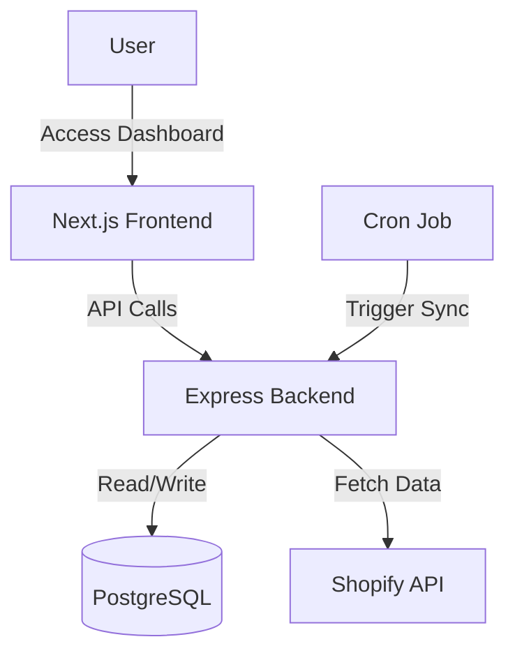

# Multi-Tenant Shopify Data Ingestion & Insights Service

This project is a multi-tenant SaaS platform that connects to Shopify stores, ingests their data (Customers, Orders, Products), stores it in a relational database, and provides an analytics dashboard for insights.

## 🚀 Quick Start

**Using Docker (Recommended):**
```bash
# Clone and navigate to project
cd shopify

# Start all services
docker-compose up -d

# Access the dashboard
open http://localhost:3000
```

**Manual Setup:**
See [DEPLOYMENT.md](DEPLOYMENT.md) for detailed setup instructions.

## Architecture


The system consists of:
- **Backend**: Node.js (Express) API with TypeScript.
- **Database**: PostgreSQL with Prisma ORM.
- **Frontend**: Next.js (React) Dashboard with Tailwind CSS.
- **Worker**: Cron-based scheduler for periodic data syncing.



## Features
- **Multi-Tenancy**: Supports multiple Shopify stores with data isolation.
- **Data Ingestion**: Fetches Products, Customers, and Orders from Shopify.
- **Dashboard**: Visualizes key metrics (Revenue, Orders, Customers).
- **Scheduler**: Automatically syncs data every minute (demo config).

## Setup Instructions

### Prerequisites
- Node.js (v18+)
- Node.js (v18+)
- Shopify Partner Account (for creating development stores)

### Backend Setup
1. Navigate to `backend`:
   ```bash
   cd backend
   ```
2. Install dependencies:
   ```bash
   npm install
   ```
3. Configure `.env`:
   ```env
   PORT=4000
   DATABASE_URL="file:./dev.db"
   ```
4. Run migrations (creates local SQLite db):
   ```bash
   npx prisma db push
   ```
5. Start the server:
   ```bash
   npm run dev
   ```

### Frontend Setup
1. Navigate to `frontend`:
   ```bash
   cd frontend
   ```
2. Install dependencies:
   ```bash
   npm install
   ```
3. Start the development server:
   ```bash
   npm run dev
   ```
4. Open [http://localhost:3000](http://localhost:3000).

## Usage
1. **Register Tenant**: Use Postman or curl to register a tenant via `POST /api/tenants/register`.
   ```json
   {
     "name": "My Store",
     "shopify_store_url": "my-store.myshopify.com",
     "api_key": "shpat_...",
     "api_secret": "..."
   }
   ```
2. **Login**: Go to the frontend, enter the Tenant ID returned from registration.
3. **View Insights**: See your store's data populated in the dashboard.

## Project Structure

```
shopify/
├── backend/                 # Node.js + Express API
│   ├── src/
│   │   ├── controllers/    # Request handlers
│   │   ├── routes/         # API routes
│   │   ├── services/       # Business logic
│   │   └── utils/          # Utilities
│   ├── prisma/             # Database schema
│   ├── Dockerfile
│   └── package.json
├── frontend/               # Next.js Dashboard
│   ├── app/               # Pages and layouts
│   ├── public/            # Static assets
│   ├── Dockerfile
│   └── package.json
├── docker-compose.yml     # Docker orchestration
├── API_DOCUMENTATION.md   # API reference
├── ARCHITECTURE.md        # System architecture
├── DEPLOYMENT.md          # Deployment guide
├── TESTING.md            # Testing guide
└── README.md             # This file
```

## Documentation

- **[API Documentation](API_DOCUMENTATION.md)** - Complete API reference with examples
- **[Architecture](ARCHITECTURE.md)** - System design and technical decisions
- **[Deployment Guide](DEPLOYMENT.md)** - Local, Docker, and production deployment
- **[Testing Guide](TESTING.md)** - How to run and write tests

## API Endpoints

- `POST /api/tenants/register`: Register a new tenant
- `POST /api/ingestion/trigger`: Manually trigger data sync
- `GET /api/analytics/stats`: Get dashboard statistics

See [API_DOCUMENTATION.md](API_DOCUMENTATION.md) for detailed endpoint documentation.
